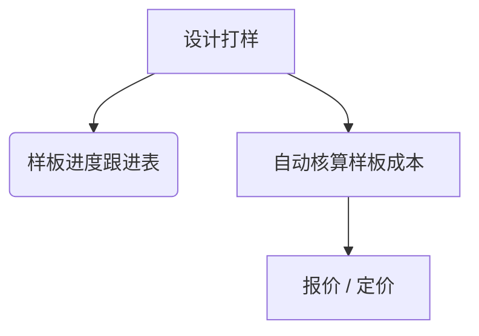
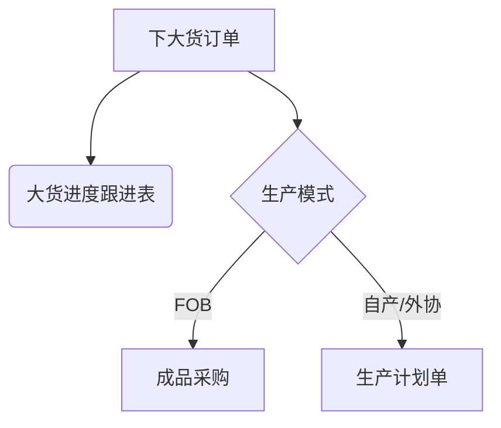
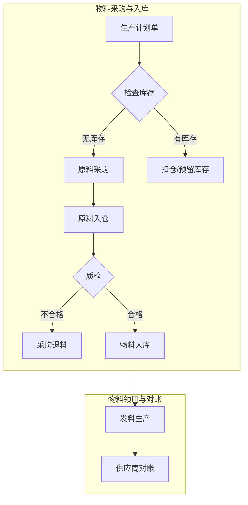
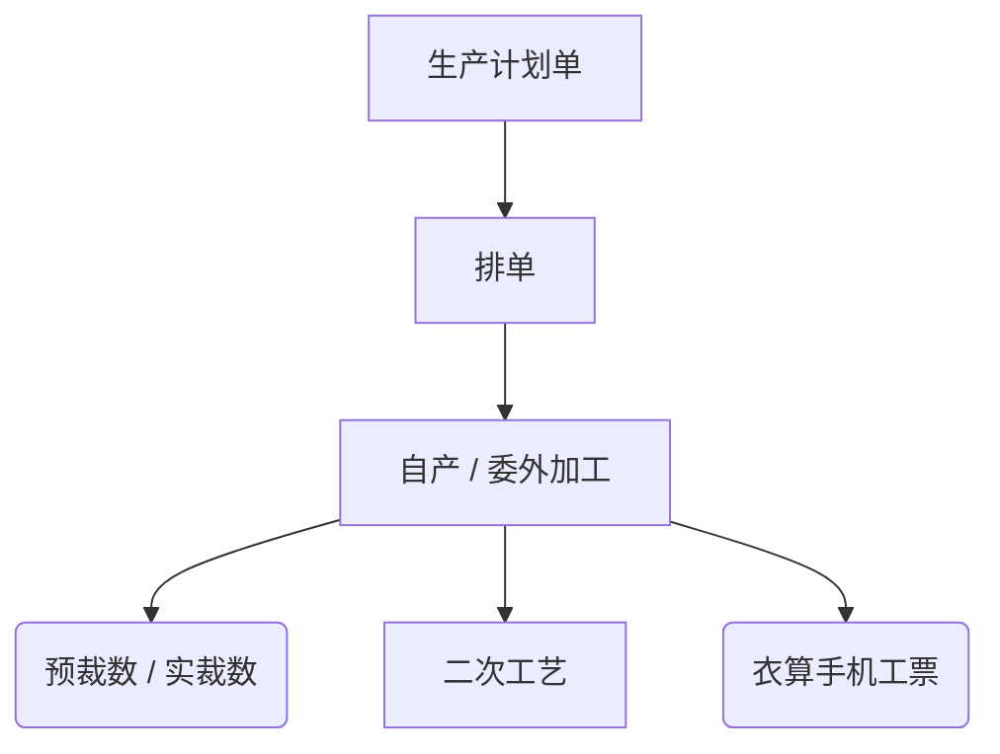
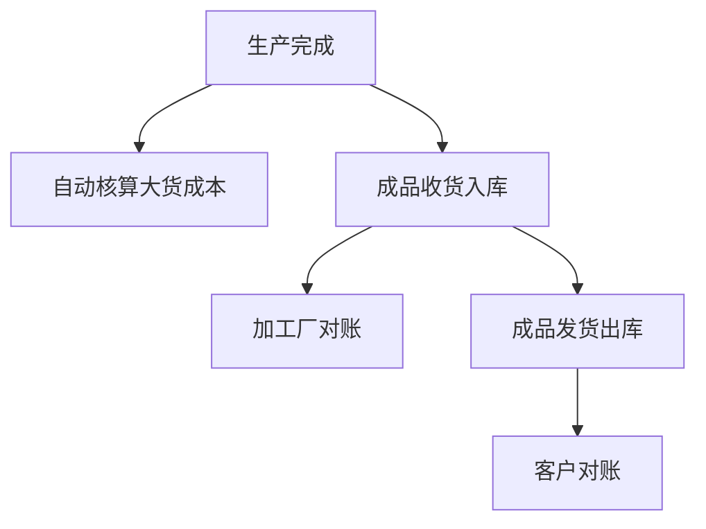
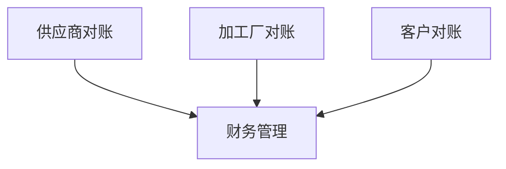

# 用户体验地图

## 功能优势
我把我们2种类型的功能大概跟您介绍一下：
1、K19版本：是针对办公室用，整个供应链管理的软件，从打样开始管理，样板、成本、订单、利润、物料采购、物料进销存、成品进销存、到最后财务的对帐结算，期间包括我们样品及大货进度的管控，以及各种数据报表，数据的分析等等。
2、衣算手机工票：是针对车间工人扫菲的手机工票软件，统计工人的计件工资统计，车间每个款每道工序进度的管理的扫菲软件。

这两种类型的软件，我们是打通的，可以合在一起用，也可以分开来单独使用用

---

## 服装生产供应链核心流程分析

基于提供的业务流程图，我们将整个服装生产和供应链管理过程拆解为以下几个核心阶段和模块。

### 1. 核心功能模块 (基础数据)

这是整个系统的基础，管理着所有核心档案信息：

-   **款式档案**: 管理所有产品的款式、设计、工艺等信息。
-   **客户档案**: 管理客户信息，用于订单和财务对接。
-   **供应商档案**: 管理原料供应商信息，用于采购和财务对接。
-   **加工厂档案**: 管理外协加工厂信息，用于委外生产和财务对接。
-   **原料档案**: 管理所有物料、辅料的规格、库存等信息。

### 2. 研发与样品阶段

此阶段主要关注从设计到大货订单前的准备工作。

-   **设计打样**: 流程起点，设计师完成款式设计并安排制作样品。
-   **样板进度跟进表**: 系统记录和追踪样品的制作进度。
-   **自动核算样板成本**: 系统根据款式、用料和工时自动计算样品成本。
-   **报价/定价**: 基于样品成本，向客户进行报价或确定最终销售价格。

### 3. 订单与生产计划

接收客户订单并制定生产计划。

-   **下大货订单**: 客户确认报价后，正式下达批量生产订单。
-   **大货进度跟进表**: 系统生成大货订单的进度追踪表，监控整个生产流程。
-   **生产计划单**:
    -   对于需要自行生产或委外加工的订单，系统生成生产计划单。
    -   此计划单是后续物料采购、生产排单的核心依据。
    -   对于 **FOB** (Free On Board) 模式的订单，可能直接触发 **成品采购** 流程，而不是生产。

### 4. 物料管理流程

根据生产计划，进行物料的采购、入库和领用。

-   **购料决策**: 系统根据生产计划单的物料需求（BOM），自动检查原料库存。
    -   **有库存**: 直接进行库存预留或扣减（扣仓）。
    -   **无库存**: 生成 **原料采购** 订单。
-   **原料入仓与质检**: 采购的原料到货后进行入库登记，并进行质量检验。
    -   **不合格**: 执行 **采购退料** 流程。
    -   **合格**: 正式入库，更新库存数量。
-   **发料生产**: 车间根据生产计划领取物料，系统记录发料信息。
-   **供应商对账**: 物料采购完成后，进入与供应商的财务对账环节。

### 5. 生产执行与监控

此阶段为实际的生产过程，无论是自产还是委外加工。

-   **排单**: 将生产计划单分解为具体的生产任务，并分配到生产线或加工厂。
-   **自产/委外加工**: 执行生产任务。系统需记录预裁数和实裁数，用于成本和物料消耗的精确计算。
-   **二次工艺**: 对于需要额外处理（如印花、水洗等）的半成品，进入此流程。
-   **衣算手机工票**: 生产过程与工票系统打通，实时记录工人的生产数量和工序进度，用于计件工资核算和生产进度监控。

### 6. 成本核算与成品管理

生产完成后，进行成本核算与成品入库、发货。

-   **自动核算大货成本**: 在生产完成后，系统根据实际的物料消耗、工时、加工费用等，自动计算大货的最终成本。
-   **成品收货入库**: 生产完成的成品检验合格后，办理入库手续，更新成品库存。
-   **加工厂对账**: 如果是委外加工，此时需要与加工厂进行费用对账。
-   **成品发货出库**: 根据销售订单，安排成品出库和发货。
-   **客户对账**: 货物发出后，与客户进行收款对账。

### 7. 财务结算

所有业务流程的终点，将资金流进行统一管理。

-   **财务管理**: 汇集了 **供应商对账**（采购付款）、**加工厂对账**（加工费结算）和 **客户对账**（销售收款）的所有数据，形成企业完整的财务视图，进行统一的资金管理和核算。

